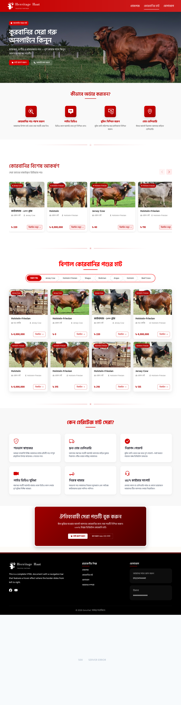

Gorurhat E-commerce Documentation
🛍️ প্ল্যাটফর্ম ওভারভিউ

  database: C:\laragon\www\orvionshop3\public\sqldatabase\gorurhat.sql

Gorurhat একটি PHP Laravel ভিত্তিক ই-কমার্স প্ল্যাটফর্ম যা শুধুমাত্র অ্যাডমিন প্যানেল পরিচালিত। এটি পণ্য, অর্ডার, স্টোক এবং রিপোর্ট ব্যবস্থাপনার জন্য সম্পূর্ণ সমাধান প্রদান করে।
👨‍💼 অ্যাডমিন প্যানেল ফিচারসমূহ
📊 ড্যাশবোর্ড

    মোট বিক্রির পরিসংখ্যান

    দৈনিক, সাপ্তাহিক, মাসিক বিক্রির চার্ট

    সাম্প্রতিক অর্ডারের ওভারভিউ

    কম স্টোক সতর্কতা

    মোট পণ্য ও ক্যাটাগরির সংখ্যা

    মোট অর্ডার ও গ্রাহক সংখ্যা

📦 পণ্য ব্যবস্থাপনা
পণ্য সংযোজন ও সম্পাদনা

    নতুন পণ্য যোগ করা

    পণ্যের নাম, বিবরণ, মূল্য সেট করা

    পণ্যের ছবি আপলোড (পাবলিক ফোল্ডারে)

    পণ্যের স্টোক সংখ্যা নির্ধারণ

    পণ্যের SKU জেনারেশন

পণ্যের বৈচিত্র্য

    আকার, রঙ, ওজন ভেদে আলাদা মূল্য

    ভ্যারিয়েন্ট অনুযায়ী স্টোক সংখ্যা

    ভ্যারিয়েন্ট ভিত্তিক ছবি আপলোড

পণ্য তালিকা

    সব পণ্য দেখুন

    পণ্য অনুসন্ধান ও ফিল্টার

    পণ্য স্ট্যাটাস (অ্যাকটিভ/ইনঅ্যাকটিভ)

    একসাথে একাধিক পণ্য ডিলিট

    CSV/Excel ফাইলের মাধ্যমে বাল্ক পণ্য আপলোড

📂 ক্যাটাগরি ব্যবস্থাপনা

    প্যারেন্ট ও চাইল্ড ক্যাটাগরি তৈরি

    ক্যাটাগরির ছবি আপলোড

    ক্যাটাগরি স্ট্যাটাস (অ্যাকটিভ/ইনঅ্যাকটিভ)

    ক্যাটাগরি অর্ডারিং ও সাজানো

    ক্যাটাগরি এডিট ও ডিলিট

🛒 অর্ডার ব্যবস্থাপনা
অর্ডার তালিকা

    সব অর্ডার দেখুন

    অর্ডার স্ট্যাটাস অনুযায়ী ফিল্টার (Pending, Processing, Shipped, Delivered, Cancelled)

    তারিখ অনুযায়ী অর্ডার সার্চ

    অর্ডার নম্বর দিয়ে সার্চ

অর্ডার অ্যাকশন

    অর্ডার স্ট্যাটাস আপডেট

    অর্ডার ডিটেইলস দেখা

    ডেলিভারী ম্যান অ্যাসাইন

    প্যাকিং স্লিপ ও ইনভয়েস প্রিন্ট

    অর্ডার নোট যোগ করা

    অর্ডার ক্যানসেল করা

📋 ইনভয়েস ও রিপোর্ট

    অর্ডারের পিডিএফ ইনভয়েস জেনারেট

    বিক্রয় রিপোর্ট (এক্সেল ও পিডিএফ)

    সর্বাধিক বিক্রি পণ্যের রিপোর্ট

    কম স্টোকের পণ্যের রিপোর্ট

    ক্যাটাগরি ভিত্তিক বিক্রয় রিপোর্ট

    দৈনিক, সাপ্তাহিক, মাসিক রিপোর্ট

👥 গ্রাহক ব্যবস্থাপনা

    সব গ্রাহকের তালিকা

    গ্রাহকের অর্ডার ইতিহাস দেখা

    গ্রাহকের তথ্য এডিট

    গ্রাহক অ্যাকাউন্ট স্ট্যাটাস (অ্যাকটিভ/ব্যান)

    গ্রাহককে নোটিফিকেশন পাঠানো

🏷️ কুপন ও ডিসকাউন্ট ব্যবস্থাপনা

    নতুন কুপন তৈরি

    পারসেন্টেজ ও ফিক্সড ডিসকাউন্ট

    কুপনের মেয়াদ নির্ধারণ

    সর্বনিম্ন অর্ডার মূল্য নির্ধারণ

    নির্দিষ্ট পণ্যের জন্য কুপন

    ব্যবহার সীমা নির্ধারণ (প্রতি গ্রাহক)

💰 পেমেন্ট ব্যবস্থাপনা

    পেমেন্ট স্ট্যাটাস আপডেট (Pending, Paid, Failed)

    ক্যাশ অন ডেলিভারী ট্র্যাকিং

    মোবাইল ব্যাংকিং পেমেন্ট ভেরিফিকেশন (bKash, Nagad, Rocket)

    পেমেন্ট হিস্টোরি দেখা

    পেমেন্ট রিপোর্ট ডাউনলোড

🚚 ডেলিভারী ব্যবস্থাপনা

    ডেলিভারী ম্যান তালিকা

    ডেলিভারী ম্যান অ্যাসাইন

    ডেলিভারী স্ট্যাটাস ট্র্যাকিং

    ডেলিভারী এরিয়া সেটিং

    ডেলিভারী চার্জ নির্ধারণ

🔔 নোটিফিকেশন সিস্টেম

    নতুন অর্ডারের ইমেইল নোটিফিকেশন

    অর্ডার স্ট্যাটাস আপডেটের এসএমএস

    কম স্টোকের অ্যালার্ট

    গ্রাহককে প্রমোশনাল মেসেজ পাঠানো

    সিস্টেম নোটিফিকেশন (অ্যাডমিন প্যানেলে)

🖼️ ইমেজ ব্যবস্থাপনা (পাবলিক পাথ)
ছবি সংরক্ষণের স্থান

সকল ছবি public/images/ ফোল্ডারে সংরক্ষণ করা হয়:
text

public/
└── images/
    ├── products/
    ├── categories/
    ├── banners/
    └── temp/

ছবির অ্যাক্সেস লিংক

    প্রোডাক্ট ছবি: http://gorurhat.com/images/products/abc.jpg

    ক্যাটাগরি ছবি: http://gorurhat.com/images/categories/electronics.png

    ব্যানার ছবি: http://gorurhat.com/images/banners/summer.jpg

ইমেজ ফিচার

    ছবি আপলোড ও ডিলিট

    ছবি রিসাইজ অপশন

    ডিফল্ট ছবি দেখানো

    একসাথে একাধিক ছবি আপলোড

🔒 সিকিউরিটি ফিচার

    অ্যাডমিন লগইন সিস্টেম

    পাসওয়ার্ড হ্যাশিং (bcrypt)

    রোল বেইজড অ্যাক্সেস কন্ট্রোল

    CSRF প্রোটেকশন

    XSS ও SQL ইনজেকশন প্রোটেকশন

    সেশন ম্যানেজমেন্ট

    লগআউট ফিচার

📁 ব্যাকআপ ও রিস্টোর

    ডাটাবেজ ব্যাকআপ

    ইমেজ ফোল্ডার ব্যাকআপ

    ব্যাকআপ ডাউনলোড

    ব্যাকআপ রিস্টোর সিস্টেম

⚙️ সেটিংস প্যানেল

    ওয়েবসাইটের নাম ও লোগো সেটিং

    কারেন্সি সেটিংস

    পেমেন্ট গেটওয়ের সেটিংস

    ইমেইল কনফিগারেশন

    এসএমএস গেটওয়ে সেটিংস

    ডেলিভারী চার্জ সেটিংস

📋 ফিচার সামারি টেবিল
ফিচার ক্যাটাগরি	ফিচারসমূহ
ড্যাশবোর্ড	বিক্রির পরিসংখ্যান, চার্ট, স্টোক অ্যালার্ট
পণ্য ব্যবস্থাপনা	পণ্য সংযোজন/সম্পাদনা/ডিলিট, ভ্যারিয়েন্ট, স্টোক, বাল্ক আপলোড
ক্যাটাগরি ব্যবস্থাপনা	প্যারেন্ট/চাইল্ড ক্যাটাগরি, ছবি, স্ট্যাটাস
অর্ডার ব্যবস্থাপনা	স্ট্যাটাস আপডেট, ইনভয়েস, ডেলিভারী অ্যাসাইন, ক্যানসেল
ইনভয়েস ও রিপোর্ট	পিডিএফ/এক্সেল রিপোর্ট, বিক্রয়, স্টোক রিপোর্ট
গ্রাহক ব্যবস্থাপনা	গ্রাহক তালিকা, অর্ডার হিস্টোরি, স্ট্যাটাস
কুপন ব্যবস্থাপনা	ডিসকাউন্ট কুপন, মেয়াদ, সীমা নির্ধারণ
পেমেন্ট ব্যবস্থাপনা	পেমেন্ট স্ট্যাটাস, মোবাইল ব্যাংকিং, রিপোর্ট
ডেলিভারী ব্যবস্থাপনা	ডেলিভারী ম্যান, এরিয়া, চার্জ সেটিংস
নোটিফিকেশন	ইমেইল, এসএমএস, সিস্টেম অ্যালার্ট
ইমেজ ব্যবস্থাপনা	আপলোড, ডিলিট, রিসাইজ, পাবলিক পাথ
সিকিউরিটি	লগইন, হ্যাশিং, রোল বেসড অ্যাক্সেস, CSRF
ব্যাকআপ	ডাটাবেজ ও ফোল্ডার ব্যাকআপ, রিস্টোর
সেটিংস	সাইট সেটিংস, কারেন্সি, পেমেন্ট ও ইমেইল কনফিগ
